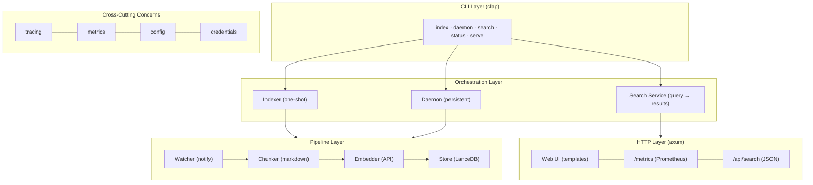
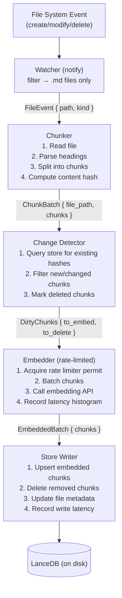
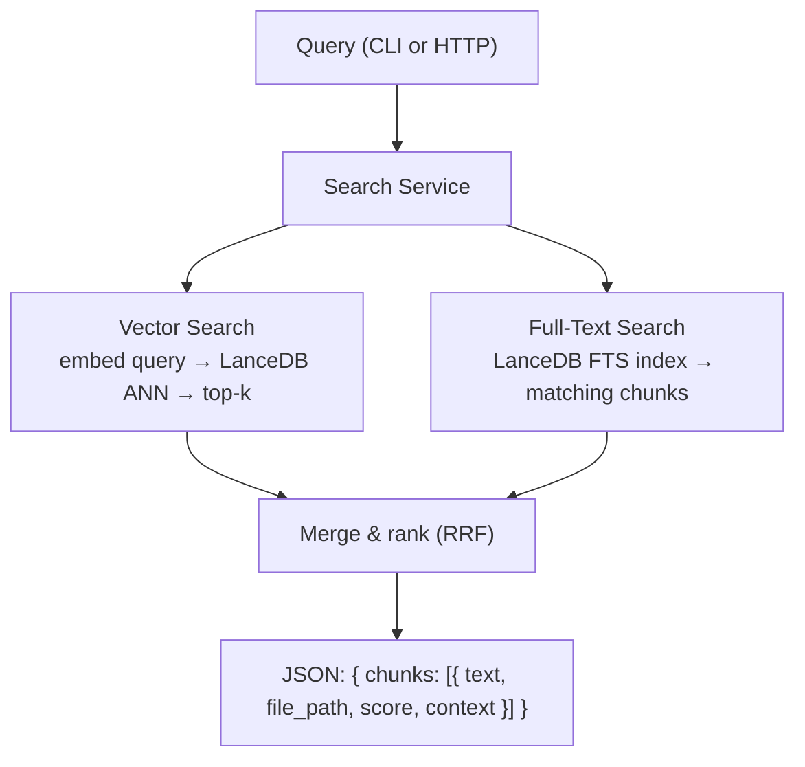
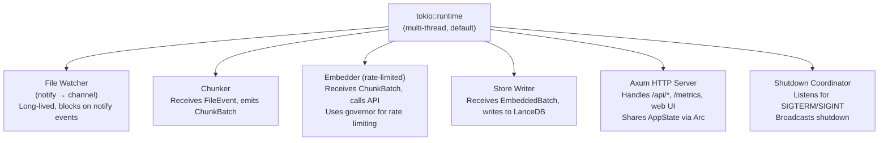

# Architecture Research

**Domain:** Rust file-indexing daemon with embedded vector search
**Researched:** 2026-04-08
**Confidence:** MEDIUM (web verification tools unavailable; based on training data through early 2025 -- LanceDB Rust API and Anthropic embedding strategy need phase-specific verification)

## Critical Finding: Anthropic Embeddings API

**LOW confidence -- must verify before implementation.**

As of early 2025, Anthropic does NOT offer a first-party embeddings API. They partnered with Voyage AI, whose models (voyage-3, voyage-code-3) are recommended in Anthropic's documentation. Voyage AI accepts Anthropic API keys through a compatibility layer OR its own keys.

**Impact on architecture:** The embedder component must be designed as a trait so the backing provider (Voyage AI, or a future Anthropic-native endpoint) can be swapped without touching the pipeline. The PROJECT.md references "Anthropic embeddings API" and `text-embedding-3-*` models -- the latter are OpenAI model names, not Anthropic/Voyage. This needs resolution in Phase 1.

**Recommendation:** Design the `Embedder` trait early. Start with Voyage AI's API (most likely what's actually available). If Anthropic has shipped a native embeddings endpoint by build time, swap in.

## System Overview



## Component Responsibilities

| Component | Responsibility | Communicates With |
|-----------|---------------|-------------------|
| **CLI (clap)** | Parse args, route to subcommand handler | All orchestration components |
| **Watcher** | Detect file create/modify/move/delete via `notify` crate | Indexing pipeline (via channel) |
| **Chunker** | Split markdown by heading into embedding units | Receives file paths, emits chunks |
| **Embedder** | Call embedding API, manage rate limits, batch requests | Receives chunks, emits vectors |
| **Store** | Read/write LanceDB: upsert chunks, query vectors, full-text search | All components that need data |
| **Search Service** | Orchestrate vector + full-text queries, rank, format results | Store, CLI, HTTP layer |
| **HTTP Server** | Serve web UI, metrics endpoint, API endpoints | Search service, metrics registry |
| **Metrics** | Collect histograms/counters, expose Prometheus format | All components instrument into it |
| **Config** | Resolve CLI flags + env vars + .env file into typed config | All components read from it |
| **Credentials** | Resolve API key from env var or ~/.claude/ store | Embedder |

## Recommended Project Structure

```
src/
├── main.rs                 # Entry point: clap parse → dispatch
├── cli/
│   ├── mod.rs              # Clap derive structs, subcommand enum
│   ├── index.rs            # One-shot index handler
│   ├── daemon.rs           # Daemon mode handler
│   ├── search.rs           # Search command handler
│   ├── status.rs           # Status command handler
│   └── serve.rs            # HTTP-only serve handler
├── pipeline/
│   ├── mod.rs              # Pipeline orchestration (watcher → chunker → embedder → store)
│   ├── watcher.rs          # notify-based file watcher, emits FileEvent
│   ├── chunker.rs          # Markdown → Vec<Chunk> by heading
│   ├── embedder.rs         # Embedder trait + API implementation
│   └── coordinator.rs      # Async task coordination, rate limiting, queue management
├── store/
│   ├── mod.rs              # Store trait + LanceDB implementation
│   ├── schema.rs           # Arrow schema definitions, LanceDB table setup
│   ├── writer.rs           # Batch upsert logic, deduplication
│   └── reader.rs           # Vector search, full-text search, metadata queries
├── server/
│   ├── mod.rs              # Axum router setup
│   ├── api.rs              # JSON API endpoints (/api/search, /api/status)
│   ├── web.rs              # Web UI routes (HTML templates)
│   └── metrics.rs          # /metrics endpoint handler
├── config.rs               # Config struct, resolution logic (clap + env + .env)
├── credentials.rs          # API key resolution (env var → ~/.claude/ fallback)
├── metrics.rs              # Global metrics registry, histogram definitions
└── error.rs                # Unified error types (thiserror)
```

### Structure Rationale

- **cli/**: One file per subcommand keeps each handler focused. The `mod.rs` owns the clap derive structs so the `main.rs` stays thin.
- **pipeline/**: The core indexing pipeline is the heart of the system. Separating watcher, chunker, embedder, and coordinator makes each independently testable. The coordinator owns async task orchestration.
- **store/**: Isolates all LanceDB interaction. The trait boundary means you could swap to a different vector DB without touching pipeline code. Reader/writer split keeps query and mutation logic separate.
- **server/**: Axum routes grouped by concern. API endpoints return JSON; web routes return HTML. Metrics has its own handler.
- **Top-level modules**: Config, credentials, metrics, and error are cross-cutting and used by everything.

## Architectural Patterns

### Pattern 1: Channel-Based Pipeline with Backpressure

**What:** Connect pipeline stages with bounded `tokio::mpsc` channels. Watcher sends `FileEvent` to chunker task; chunker sends `Vec<Chunk>` to embedder task; embedder sends `EmbeddedChunk` to writer task.

**When to use:** Always -- this is the core data flow pattern.

**Trade-offs:** Bounded channels provide natural backpressure (if the embedder is slow, the chunker blocks). Unbounded channels risk memory exhaustion during large re-indexes.

```rust
// Pipeline wiring in coordinator.rs
let (file_tx, file_rx) = tokio::sync::mpsc::channel::<FileEvent>(64);
let (chunk_tx, chunk_rx) = tokio::sync::mpsc::channel::<ChunkBatch>(32);
let (embed_tx, embed_rx) = tokio::sync::mpsc::channel::<EmbeddedBatch>(16);

// Each stage is a tokio::spawn'd task
let watcher_handle = tokio::spawn(watcher::run(watch_path, file_tx));
let chunker_handle = tokio::spawn(chunker::run(file_rx, chunk_tx));
let embedder_handle = tokio::spawn(embedder::run(chunk_rx, embed_tx, rate_limiter));
let writer_handle = tokio::spawn(writer::run(embed_rx, store));
```

**Channel sizing rationale:**
- `file_tx` (64): File events are tiny, burst during initial scan
- `chunk_tx` (32): Chunks are small text, moderate buffer
- `embed_tx` (16): Embedded chunks carry vectors (~4KB each for 1024-dim f32), keep tight

### Pattern 2: Rate-Limited API Client with Token Bucket

**What:** Wrap the embedding API client with a `governor` rate limiter (token bucket algorithm). The embedder task acquires a permit before each API call.

**When to use:** Always for the Anthropic/Voyage API calls.

**Trade-offs:** Adds a small dependency but prevents 429 errors and account-level rate limit issues. The `governor` crate is the standard Rust token bucket implementation.

```rust
use governor::{Quota, RateLimiter};
use std::num::NonZeroU32;

// 50 requests per minute (adjust to actual API limits)
let quota = Quota::per_minute(NonZeroU32::new(50).unwrap());
let limiter = RateLimiter::direct(quota);

// In embedder loop:
limiter.until_ready().await;
let response = client.embed(batch).await?;
```

### Pattern 3: Shared AppState via Arc

**What:** A single `AppState` struct wrapped in `Arc` holds shared resources: the LanceDB connection, metrics registry, config. Passed to axum handlers and pipeline tasks.

**When to use:** Whenever multiple components need the same resource.

**Trade-offs:** Simple, well-understood. Avoids global statics. The `Arc<AppState>` pattern is idiomatic axum.

```rust
pub struct AppState {
    pub store: Store,           // LanceDB connection (already internally thread-safe)
    pub metrics: MetricsRegistry,
    pub config: AppConfig,
    pub pipeline_status: Arc<RwLock<PipelineStatus>>,
}

// Axum usage:
let state = Arc::new(AppState { /* ... */ });
let app = Router::new()
    .route("/api/search", get(search_handler))
    .with_state(state);
```

### Pattern 4: Dual-Mode Execution (Daemon vs One-Shot)

**What:** The `index` subcommand runs the pipeline once (scan all files, embed, exit). The `daemon` subcommand starts the watcher, HTTP server, and pipeline, then runs until SIGTERM.

**When to use:** This is how the CLI routing works.

```rust
// In main.rs dispatch
match cli.command {
    Command::Index(args) => {
        // One-shot: scan → chunk → embed → write → exit
        let pipeline = Pipeline::new(config, store);
        pipeline.run_full_index().await?;
    }
    Command::Daemon(args) => {
        // Persistent: start watcher + server + pipeline, block on signal
        let (shutdown_tx, shutdown_rx) = tokio::sync::broadcast::channel(1);
        tokio::select! {
            _ = run_watcher_pipeline(config, store, shutdown_rx.resubscribe()) => {},
            _ = run_http_server(state, shutdown_rx.resubscribe()) => {},
            _ = tokio::signal::ctrl_c() => { shutdown_tx.send(()).ok(); },
        }
    }
    Command::Search(args) => { /* query store, print JSON, exit */ }
    Command::Status(args) => { /* query store metadata, print, exit */ }
    Command::Serve(args) => { /* HTTP server only, no watcher */ }
}
```

## Data Flow

### Indexing Flow (Core Pipeline)



### Search Flow



### Delete Flow


## LanceDB Schema Design

**MEDIUM confidence -- LanceDB Rust API details need verification at build time.**

LanceDB uses Apache Arrow schemas. The table design:

### `chunks` Table

| Column | Arrow Type | Purpose |
|--------|-----------|---------|
| `chunk_id` | `Utf8` | Primary key: `{file_path}::{heading_path}` |
| `file_path` | `Utf8` | Vault-relative path (e.g., `notes/topic.md`) |
| `heading_path` | `Utf8` | Heading hierarchy (e.g., `# Main / ## Sub`) |
| `heading_level` | `UInt8` | Heading depth (1-6) |
| `content` | `Utf8` | Raw markdown text of the chunk |
| `content_hash` | `Utf8` | SHA-256 of content (for change detection) |
| `vector` | `FixedSizeList<Float32, DIM>` | Embedding vector (DIM = model-dependent, likely 1024) |
| `char_count` | `UInt32` | Character count of content |
| `created_at` | `Timestamp` | First indexed time |
| `updated_at` | `Timestamp` | Last re-indexed time |

### `files` Table (metadata)

| Column | Arrow Type | Purpose |
|--------|-----------|---------|
| `file_path` | `Utf8` | Vault-relative path |
| `file_hash` | `Utf8` | SHA-256 of entire file (for quick skip) |
| `chunk_count` | `UInt32` | Number of chunks in this file |
| `last_indexed` | `Timestamp` | When file was last processed |
| `file_size` | `UInt64` | File size in bytes |

### Key Design Decisions

- **chunk_id as composite key:** Using `{file_path}::{heading_path}` means renaming a heading creates a new chunk (old one gets deleted). This is correct -- the semantic content has changed if the heading changed.
- **content_hash for incremental indexing:** Before embedding, check if `content_hash` matches. If unchanged, skip the API call. This is the primary cost-saving mechanism.
- **Separate files table:** Enables fast "has this file changed?" checks using file-level hash before even reading the file content. Also powers the status/index browser UI.

### Indexing Strategy

LanceDB supports creating ANN (approximate nearest neighbor) indexes on vector columns. For this scale (personal vault, likely < 100K chunks):

- **IVF-PQ index** on `vector` column -- create after initial bulk load, rebuild periodically
- **Full-text index** on `content` column -- LanceDB supports this natively via Tantivy integration
- At small scale (< 10K chunks), brute-force search is fast enough; index creation can be deferred

## Async Task Coordination

### Tokio Runtime Layout (Daemon Mode)



### Graceful Shutdown

Use `tokio::sync::broadcast` for shutdown signaling. Each long-lived task receives a `shutdown_rx` and uses `tokio::select!` to check it alongside its main work loop:

```rust
loop {
    tokio::select! {
        Some(event) = file_rx.recv() => { process(event).await; }
        _ = shutdown_rx.recv() => { break; }
    }
}
```

### One-Shot Mode

No watcher, no HTTP server. Just:
1. Walk directory tree (use `walkdir` crate)
2. Chunk all markdown files
3. Diff against existing store
4. Embed changed chunks (with rate limiting)
5. Write to store
6. Print summary, exit

## Metrics Architecture

### Global Registry Pattern

Use the `prometheus` crate with a global `Registry`. Define all metrics as lazy statics or in a `MetricsRegistry` struct created at startup.

**Recommendation:** Use a `MetricsRegistry` struct (not lazy statics) passed via `Arc<AppState>`. This is more testable and avoids global state issues.

```rust
pub struct MetricsRegistry {
    pub api_call_duration: Histogram,     // Embedding API latency
    pub api_calls_total: IntCounter,      // Total API calls
    pub api_errors_total: IntCounter,     // Failed API calls
    pub chunks_indexed: IntCounter,       // Chunks written to store
    pub chunks_skipped: IntCounter,       // Chunks skipped (unchanged)
    pub search_duration: Histogram,       // Search query latency
    pub search_queries_total: IntCounter, // Total search queries
    pub files_watched: IntGauge,          // Currently watched files
    pub pending_queue_depth: IntGauge,    // Items waiting in pipeline
    pub index_duration: Histogram,        // Full file indexing time
}
```

### HDR Histogram Placement

The `prometheus` crate's `Histogram` type supports custom bucket boundaries. Define buckets tuned to each operation's expected latency range:

| Metric | Bucket Range | Rationale |
|--------|-------------|-----------|
| `api_call_duration` | 50ms, 100ms, 250ms, 500ms, 1s, 2.5s, 5s, 10s | API calls: typically 200ms-2s |
| `search_duration` | 1ms, 5ms, 10ms, 25ms, 50ms, 100ms, 250ms, 500ms | Local vector search: typically 5-50ms |
| `index_duration` | 10ms, 50ms, 100ms, 250ms, 500ms, 1s, 5s, 10s | Per-file processing time |

**Note:** The `prometheus` crate uses standard histogram (not true HDR histograms). For actual HDR histogram support, use `metrics` + `metrics-exporter-prometheus` which supports the `hdrhistogram` crate internally. This is a better choice for tail latency accuracy.

**Recommendation:** Use the `metrics` facade crate + `metrics-exporter-prometheus` rather than the `prometheus` crate directly. The `metrics` crate provides a cleaner API (`metrics::histogram!("api_call_duration", duration)`) and the exporter handles Prometheus format. This also supports true HDR histograms.

## CLI Subcommand Routing

```rust
use clap::{Parser, Subcommand};

#[derive(Parser)]
#[command(name = "local-index", about = "Semantic search over local markdown")]
pub struct Cli {
    /// Path to the vault/directory to index
    #[arg(short, long, default_value = ".")]
    pub path: PathBuf,

    /// LanceDB database path
    #[arg(long, default_value = ".local-index/db")]
    pub db_path: PathBuf,

    /// Log level
    #[arg(long, default_value = "info")]
    pub log_level: String,

    #[command(subcommand)]
    pub command: Command,
}

#[derive(Subcommand)]
pub enum Command {
    /// One-shot: index all files and exit
    Index {
        /// Force re-index all chunks (ignore content hashes)
        #[arg(long)]
        force: bool,
    },

    /// Run as daemon: watch files + serve HTTP
    Daemon {
        /// HTTP server port
        #[arg(long, default_value = "3000")]
        port: u16,
    },

    /// Search the index
    Search {
        /// Search query
        query: String,
        /// Max results
        #[arg(short = 'n', long, default_value = "10")]
        limit: usize,
        /// Minimum similarity score (0.0-1.0)
        #[arg(long, default_value = "0.0")]
        threshold: f64,
    },

    /// Show index status
    Status,

    /// Run HTTP server only (no file watcher)
    Serve {
        #[arg(long, default_value = "3000")]
        port: u16,
    },
}
```

## Credential Resolution

### Resolution Order

1. `ANTHROPIC_API_KEY` environment variable (highest priority)
2. `.env` file in working directory (loaded via `dotenvy` crate)
3. `~/.claude/` credential store (lowest priority, fallback)

### ~/.claude/ Credential Format

**LOW confidence -- could not verify the actual file format. This needs investigation during implementation.**

Based on training data, Claude Code stores credentials in `~/.claude/` but the exact file format is not well-documented publicly. Likely candidates:

- `~/.claude/credentials.json` -- JSON with API key fields
- `~/.claude/.credentials` -- possibly a simpler key-value format

**Recommendation:** During Phase 1, the developer should inspect their own `~/.claude/` directory to determine the actual format. Design the credential resolver as:

```rust
pub fn resolve_api_key() -> Result<String, CredentialError> {
    // 1. Explicit env var
    if let Ok(key) = std::env::var("ANTHROPIC_API_KEY") {
        return Ok(key);
    }

    // 2. .env file (dotenvy already loaded at startup)
    // dotenvy loads into env, so step 1 catches this too

    // 3. ~/.claude/ fallback
    resolve_from_claude_store()
}

fn resolve_from_claude_store() -> Result<String, CredentialError> {
    let home = dirs::home_dir().ok_or(CredentialError::NoHome)?;
    let cred_path = home.join(".claude").join("credentials.json");
    // Parse and extract -- format TBD at implementation time
    todo!("Verify actual credential file format")
}
```

## Claude Code Skill File Structure

### Skill File Layout

```
.claude/
└── skills/
    ├── search.md          # Semantic search skill
    ├── reindex.md         # Trigger re-indexing
    └── index-status.md    # Check index health
```

### Skill File Format

Each `.md` file in `.claude/skills/` is a Claude Code skill. Format:

```markdown
---
name: search-notes
description: Search the local note index semantically
---

# Search Notes

Run semantic search over the indexed markdown vault.

## Usage

\`\`\`bash
local-index search "<query>" -n <limit>
\`\`\`

## Output Format

JSON array of results:
- `text`: matching chunk content
- `file_path`: vault-relative path
- `score`: similarity score (0-1)
- `heading`: heading hierarchy

## Examples

Search for notes about a topic:
\`\`\`bash
local-index search "how authentication works" -n 5
\`\`\`
```

**Note:** Skill files are markdown that Claude Code reads to understand how to use tools. They should describe the CLI interface, expected output format, and usage examples. Claude Code uses the description to decide when to invoke the skill.

## Anti-Patterns

### Anti-Pattern 1: Unbounded Channels in the Pipeline

**What people do:** Use `tokio::sync::mpsc::unbounded_channel()` between pipeline stages.
**Why it's wrong:** During a full re-index of a large vault, the watcher/walker emits thousands of file events instantly. Without backpressure, the channel grows unbounded while the embedder (the bottleneck -- rate-limited API calls) processes slowly. Memory usage spikes.
**Do this instead:** Use bounded channels. Size them based on the downstream consumer's throughput. The embedder's rate limit is the system's natural bottleneck; let backpressure propagate upstream.

### Anti-Pattern 2: One API Call Per Chunk

**What people do:** Send each chunk individually to the embedding API.
**Why it's wrong:** Embedding APIs support batching (multiple texts per request). Single-chunk calls waste rate limit budget and dramatically increase total latency.
**Do this instead:** Batch chunks. Collect up to N chunks (or up to a token limit), send as one batch request. Typical batch size: 10-50 chunks depending on content length and API limits.

### Anti-Pattern 3: Blocking LanceDB Calls on the Tokio Runtime

**What people do:** Call LanceDB read/write operations directly in async tasks.
**Why it's wrong:** LanceDB operations may involve disk I/O that blocks the thread. On a tokio runtime, blocking a worker thread starves other tasks.
**Do this instead:** Use `tokio::task::spawn_blocking` for LanceDB operations, or verify that the `lancedb` Rust crate's async API is truly non-blocking. If LanceDB provides native async, use it directly. If not, wrap in `spawn_blocking`.

### Anti-Pattern 4: Re-embedding Unchanged Content

**What people do:** Re-embed every chunk on every file save.
**Why it's wrong:** Embedding API calls cost money and time. A typical file edit changes one section; the other 10 sections are identical.
**Do this instead:** Hash each chunk's content. Store the hash alongside the embedding. On file change, re-chunk, compare hashes, only embed chunks with new hashes. This is the single most impactful optimization for operational cost.

### Anti-Pattern 5: Global Mutable State for Metrics

**What people do:** Use `lazy_static!` or `once_cell` globals for Prometheus metrics.
**Why it's wrong:** Makes testing difficult (metrics leak between tests), harder to reason about, and prevents running multiple instances in the same process (testing).
**Do this instead:** Create a `MetricsRegistry` struct, pass it through `AppState`. In tests, create a fresh registry per test.

## Integration Points

### External Services

| Service | Integration Pattern | Notes |
|---------|---------------------|-------|
| Embedding API (Voyage/Anthropic) | HTTPS REST, rate-limited via governor | Batch requests, retry with exponential backoff on 429/5xx |
| File System | `notify` crate, async event stream | Filter to .md files only, debounce rapid saves |
| LanceDB (embedded) | Direct Rust crate calls, in-process | No network; data in `{db_path}/` directory |

### Internal Boundaries

| Boundary | Communication | Notes |
|----------|---------------|-------|
| Watcher -> Chunker | `mpsc::channel<FileEvent>` | Bounded, async |
| Chunker -> Embedder | `mpsc::channel<ChunkBatch>` | Bounded, includes change detection filter |
| Embedder -> Writer | `mpsc::channel<EmbeddedBatch>` | Bounded, carries vectors |
| CLI -> Store | Direct function call | One-shot commands read store directly |
| HTTP -> Search Service | Axum handler calls service method | Via `Arc<AppState>` |
| HTTP -> Metrics | Handler reads registry | `/metrics` endpoint serializes registry |

## Suggested Build Order

Based on dependency analysis, the recommended implementation order:

### Phase 1: Foundation (no external dependencies)
1. **Config + CLI scaffolding** -- clap derive structs, config resolution, error types
2. **Credential resolution** -- env var + .env + ~/.claude/ fallback
3. **Markdown chunker** -- pure function, no I/O dependencies, highly testable
4. **Tracing setup** -- structured logging from the start

**Rationale:** These have zero external dependencies and can be tested in isolation. The chunker is the most complex pure logic and benefits from early, thorough testing.

### Phase 2: Storage Layer
5. **LanceDB store** -- schema creation, writer (upsert/delete), reader (vector search, full-text)
6. **Content hashing + change detection** -- compare chunk hashes against store

**Rationale:** Storage must exist before the pipeline can write. Build read and write together since schema design affects both.

### Phase 3: Embedding Pipeline
7. **Embedder trait + implementation** -- API client, batching, rate limiting (governor)
8. **Pipeline coordinator** -- wire watcher/chunker/embedder/writer with channels
9. **One-shot index command** -- walkdir + full pipeline, first end-to-end test

**Rationale:** The embedder is the riskiest component (external API, cost implications, rate limits). Build it before the daemon so you can test the full pipeline in one-shot mode first.

### Phase 4: Daemon + Server
10. **File watcher** -- notify integration, debouncing, .md filtering
11. **Daemon mode** -- watcher + pipeline + graceful shutdown
12. **Axum HTTP server** -- search API endpoint, metrics endpoint
13. **Search CLI command** -- query interface, JSON output

**Rationale:** Daemon mode depends on all pipeline components. The HTTP server shares the runtime and needs the search service.

### Phase 5: Observability + Polish
14. **Metrics registry** -- histograms, counters, gauges across all components
15. **Web UI** -- search page, index browser, status dashboard
16. **Status command** -- index health reporting
17. **Claude Code skill files** -- .claude/skills/ markdown files

**Rationale:** Observability and UI are additive; the system works without them. Skill files are the last step since they just wrap the CLI.

## Sources

- Training data for Rust ecosystem patterns (tokio, axum, clap, notify, tracing) -- HIGH confidence on established patterns
- Training data for LanceDB Rust crate -- MEDIUM confidence (API may have evolved)
- Training data for Anthropic embedding situation -- LOW confidence (may have changed; Voyage AI partnership was current as of early 2025)
- Prometheus/metrics crate patterns -- HIGH confidence on established patterns

---
*Architecture research for: Rust file-indexing daemon with embedded vector search*
*Researched: 2026-04-08*
