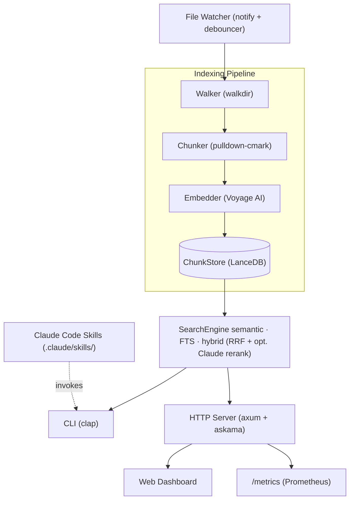
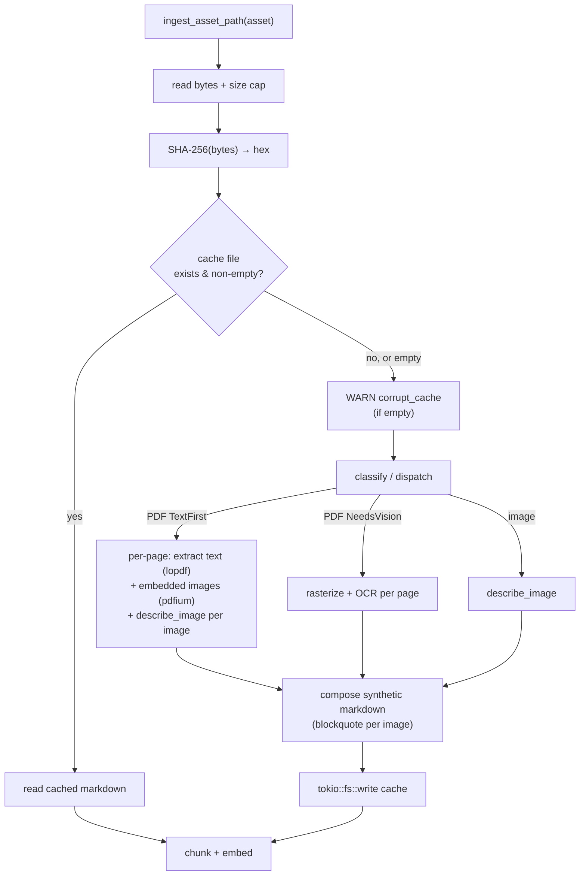

# local-index

A Rust daemon that watches a directory tree (initially an Obsidian vault), chunks markdown files using smart size-based splitting, embeds each chunk via the Voyage AI API, and stores everything in an embedded LanceDB database. Exposes full-text and semantic search via CLI, a Claude Code skill interface, and a web dashboard — enabling Claude to reason over your notes without resorting to grep.

## Inspiration

local-index draws heavy inspiration from [qmd](https://github.com/tobi/qmd) (by Tobi Lütke), a local search engine for markdown knowledge bases. The chunking algorithm, hybrid search strategy, and break-point scoring system all trace back to qmd's design:

- **Smart chunking** — qmd pioneered the ~900-token chunk target with 15% overlap and scored break points (headings, code fences, blank lines) rather than naive fixed-size splits. local-index ports this approach to Rust with the same constants (3600 chars / 540 overlap / 800 look-back window).
- **Hybrid search with RRF** — qmd combines BM25 full-text and vector semantic search, fusing results via Reciprocal Rank Fusion. local-index follows the same fusion strategy using LanceDB's native FTS and vector indexes.
- **Code fence protection** — the chunker avoids splitting inside fenced code blocks, preserving code snippets intact for embedding quality.

Where local-index diverges: it uses **Voyage AI** for embeddings instead of local models, adds an optional **Claude (Anthropic Messages API)** second-stage rerank on top of LanceDB hybrid fusion (no local GGUF), and is written entirely in Rust as a single statically-linked binary.

## Architecture



### Pipeline

1. **Walker** — recursively discovers `.md` files, skipping hidden directories.
2. **Chunker** — parses each file with `pulldown-cmark`, extracts YAML frontmatter, then splits the body into ~3600-character chunks using scored break points (headings, code fences, blank lines, HRs, list items). Each chunk carries a heading breadcrumb (`## Goals > ### Q1`) and line range metadata.
3. **Embedder** — sends chunks to the Voyage AI API (`voyage-3.5`, 1024 dimensions) in batches of 50 with exponential backoff and jitter on transient failures.
4. **ChunkStore** — writes chunks and embedding vectors into a single LanceDB `chunks` table with a 10-column Arrow schema. SHA-256 content hashes enable incremental re-indexing — unchanged files are skipped entirely.

### Search

The `SearchEngine` supports three modes:

| Mode                 | Strategy                                                                  | Scoring                                |
|----------------------|---------------------------------------------------------------------------|----------------------------------------|
| **semantic**         | Cosine distance nearest-neighbor on embedding vectors                     | `1 - (distance / 2)` normalized to 0–1 |
| **fts**              | BM25 full-text search on chunk body via LanceDB FTS index                 | `score / max_score` normalized to 0–1  |
| **hybrid** (default) | Runs both FTS and vector search, fuses with Reciprocal Rank Fusion (k=60) | RRF relevance score normalized to 0–1  |

**Reranking (optional):** If `ANTHROPIC_API_KEY` is set, search fetches a larger candidate pool, calls the Anthropic Messages API with a compact prompt (query plus numbered excerpts), and reorders results using the model’s `{"indices":[...]}` permutation. `similarity_score` becomes rank-based (1.0 = best). Semantic and FTS component scores are unchanged. Disable with `--no-rerank` (CLI) or `no_rerank` on the dashboard search URL when reranking is configured.

Post-processing applies optional path prefix filters, frontmatter tag filters, minimum score thresholds, and context window expansion (surrounding chunks from the same file).

### File Watcher

The daemon watches the vault directory using `notify` with 500ms debouncing. File events (create, modify, rename, delete) flow through an async processor that re-indexes affected files and rebuilds the FTS index. The same process serves the web dashboard and Prometheus metrics endpoint.

### Database Schema

Single LanceDB table (`chunks`):

| Column                    | Type                      | Purpose                                 |
|---------------------------|---------------------------|-----------------------------------------|
| `chunk_id`                | UTF8                      | UUID per chunk                          |
| `file_path`               | UTF8                      | Vault-relative path                     |
| `heading_breadcrumb`      | UTF8                      | Heading hierarchy at chunk start        |
| `body`                    | UTF8                      | Chunk text (FTS indexed)                |
| `line_start` / `line_end` | UInt32                    | Source line range                       |
| `frontmatter_json`        | UTF8 (nullable)           | Serialized YAML frontmatter             |
| `content_hash`            | UTF8                      | SHA-256 for incremental skip            |
| `embedding_model`         | UTF8                      | Model identifier for consistency checks |
| `vector`                  | FixedSizeList[1024 × f32] | Embedding vector                        |

## Features

- **Semantic search** — vector similarity via Voyage AI embeddings (voyage-3.5, 1024 dims)
- **Full-text search** — BM25 via LanceDB's native FTS engine
- **Hybrid search** — fuses BM25 + vector results via Reciprocal Rank Fusion (RRF), with optional Claude reranking when `ANTHROPIC_API_KEY` is set
- **Smart chunking** — size-based splitting with scored break points, heading breadcrumbs, and code fence protection (inspired by [qmd](https://github.com/tobi/qmd))
- **Incremental indexing** — SHA-256 content hashes skip unchanged files; model mismatch guard prevents mixed embeddings
- **Daemon mode** — file watcher with debounced re-indexing on create/modify/rename/delete
- **Web dashboard** — search UI, index browser, status overview, and settings view (axum + askama)
- **Prometheus metrics** — `/metrics` endpoint with counters, gauges, and histograms for embedding latency, indexing throughput, search latency, and HTTP request duration
- **Claude Code skills** — invoke search, reindex, and status directly from Claude Code via `.claude/skills/` files
- **Single binary** — no runtime dependencies, no external database process, no Node/Python

## Quick Start

```sh
cargo install local-index
export VOYAGE_API_KEY="your-key-here"
# Optional: Claude reranks search results (hybrid and other modes)
export ANTHROPIC_API_KEY="your-anthropic-key"
export OBSIDIAN_VAULT="/path/to/your/vault"
local-index index "$OBSIDIAN_VAULT"
local-index search "your query"
```

## PDF and images (v1.2)

When asset preprocessing is enabled (the default), `local-index index` and `local-index daemon` discover PDFs and common raster images under the vault, turn them into synthetic markdown, embed the chunks with Voyage, and store rows in LanceDB. Operator-facing details:

- Optional extracted text for debugging and retries is written under **`asset-cache/`** inside the configured data directory (for example `<vault>/.local-index/asset-cache/` when you index in place, or `<LOCAL_INDEX_DATA_DIR>/asset-cache/` when you set a separate data directory via `--data-dir` / `LOCAL_INDEX_DATA_DIR`).
- Search results and the index browser show **`file_path` as the original vault-relative PDF or image path**; raw PDFs are not indexed as if they were separate `.md` files.
- Use **`--skip-asset-processing`** or **`LOCAL_INDEX_SKIP_ASSET_PROCESSING`** to keep runs markdown-only (no asset discovery, no vision calls).
- **`ANTHROPIC_API_KEY`** is required when an asset needs vision (scanned PDFs and images). Text-first PDFs only need **`VOYAGE_API_KEY`**.
- **`LOCAL_INDEX_MAX_PDF_PAGES`** caps how many PDF pages may be rasterized and sent through vision per file (default **30**).

### Ephemeral asset cache and idempotency

Asset preprocessing is **idempotent**. Every PDF and image is identified by
the SHA-256 of its raw bytes; before any Anthropic or OCR API call,
`local-index` checks an ephemeral on-disk cache and reuses the previously
computed synthetic markdown when the source is unchanged.

**Cache layout** — two-level shard, under the configured data directory:

```text
<data_dir>/asset-cache/ab/cd/{sha256}.txt
```

The two-byte shards (`ab/cd/`) are the first four hex characters of the
SHA-256 digest. The cache file contains the synthetic markdown produced for
that exact source content — nothing more. No companion `.processed.md`
files are ever written next to your PDFs or images in the vault.

**Cache behavior:**

- **Hit (file exists and is non-empty)** → re-use the cached markdown,
  skip the Anthropic/OCR API call entirely.
- **Miss (file does not exist)** → call the API, chunk the result, then
  write the synthetic markdown to the cache on success.
- **Corrupt (file exists but is empty or unreadable)** → emit a
  `tracing::warn!` with `corrupt_cache = true` and the path, then
  re-fetch as a cache miss and overwrite the file.

**Cache invalidation:**

```sh
rm -rf <data_dir>/asset-cache/
```

The cache key is source-bytes SHA-256 only. Changing
`LOCAL_INDEX_ASSET_MODEL` or the Anthropic vision prompt does **not**
invalidate existing cache entries — delete `asset-cache/` to force a
refresh after those kinds of changes.

**Double-index prevention:** The markdown walker only indexes files with
`.md` extension. Raw `.pdf`, `.png`, `.jpg`, `.jpeg`, and `.webp` files
are routed exclusively through the asset pipeline — they are never
indexed as if they were markdown. Combined with `file_path` attribution
pointing at the original asset path, the same PDF never produces two
sets of chunks.

**TextFirst PDF embedded images (Phase 11):** Text-first PDFs now have
their embedded raster figures extracted via `pdfium-render` and
described through Anthropic vision. For each TextFirst page, the
synthetic markdown contains the page text followed by a blockquote per
figure using the filename convention
`{stem}_page_{N}_image_{I}.png` (1-based page and image indices). Pages
are separated by `\n\n---\n\n`. Scanned-PDF pages (NeedsVision) continue
to be rasterized and OCR'd as before, with each page's OCR body wrapped
in the same blockquote format using `{stem}_page_{N}.png`.

**Graceful degradation:**

- If `ANTHROPIC_API_KEY` is not set on a TextFirst PDF with embedded
  images: a WARN is logged once and the PDF indexes its page text only
  (image descriptions are omitted).
- If the system `libpdfium` is not available: embedded-image extraction
  is skipped with a WARN; the PDF still indexes its extracted text. PDF
  *rasterization* (for scanned/NeedsVision PDFs) additionally has a
  `pdftoppm` (Poppler) fallback.



### OCR providers (scanned PDFs)

Rasterized pages from **scanned** PDFs can be turned into text with either **Anthropic vision** (default) or **Google Document AI**. Standalone images (`png`, `jpg`, `jpeg`, `webp`) still use **Anthropic** vision when `ANTHROPIC_API_KEY` is set—change that in a later phase.

| Setting | Values |
|---------|--------|
| **`LOCAL_INDEX_OCR_PROVIDER`** | `anthropic` (default) or `google` |
| CLI | `--ocr-provider anthropic` / `--ocr-provider google` on **`index`** and **`daemon`** (overrides env when passed) |

**Anthropic (default):** set **`ANTHROPIC_API_KEY`**. Same key as for standalone images.

**Google Document AI:** create a [Document AI](https://cloud.google.com/document-ai/docs) processor, then set:

- **`GOOGLE_APPLICATION_CREDENTIALS`** — path to a service account JSON key with access to Document AI
- **`GOOGLE_CLOUD_PROJECT`** — GCP project id
- **`GOOGLE_DOCUMENT_AI_LOCATION`** — processor region (e.g. `us`, `eu`)
- **`GOOGLE_DOCUMENT_AI_PROCESSOR_ID`** — processor id from the Cloud Console

If `LOCAL_INDEX_OCR_PROVIDER=google` and any of these are missing, the binary fails at startup with an error that lists every missing variable.

## CLI Reference

### `index`

```sh
local-index index <PATH> [--force-reindex] [--data-dir PATH]
```

Walk a directory recursively, chunk all `.md` files by heading, embed each chunk, and store in LanceDB. Unchanged files (by content hash) are skipped unless `--force-reindex` is set.

### `search`

```sh
local-index search "<QUERY>" [--limit N] [--min-score F] [--mode semantic|fts|hybrid] \
  [--path-filter PATH_PREFIX] [--tag-filter TAG] [--context N] [--format json|pretty] \
  [--no-rerank]
```

| Flag             | Default | Description                                                    |
|------------------|---------|----------------------------------------------------------------|
| `--limit` / `-n` | 10      | Maximum results                                                |
| `--min-score`    | (none)  | Score threshold 0.0–1.0                                        |
| `--mode`         | hybrid  | Search strategy                                                |
| `--path-filter`  | (none)  | Restrict to path prefix                                        |
| `--tag-filter`   | (none)  | Restrict by frontmatter tag                                    |
| `--context`      | 0       | Surrounding chunks to include                                  |
| `--format`       | json    | Output format                                                  |
| `--no-rerank`    | off     | Skip reranking even if a reranker is configured (e.g. key set) |

### `status`

```sh
local-index status [--data-dir PATH]
```

Show total chunks, files indexed, last index time, and embedding model info.

### `daemon`

```sh
local-index daemon <PATH> [--bind ADDR]
```

Watch a directory for changes and re-index automatically. Also serves the web dashboard and Prometheus metrics at the bind address.

### `serve`

```sh
local-index serve [--bind ADDR] [--data-dir PATH]
```

Start the web dashboard and metrics endpoint without file watching. Useful for read-only access to an existing index.

## Environment Variables

| Variable                   | Required               | Description                                                             |
|----------------------------|------------------------|-------------------------------------------------------------------------|
| `VOYAGE_API_KEY`           | Yes (for index/search) | Voyage AI API key for embeddings                                        |
| `ANTHROPIC_API_KEY`        | No                     | Anthropic API key; when set, enables Claude search reranking            |
| `LOCAL_INDEX_RERANK_MODEL` | No                     | Anthropic model id for reranking (default: `claude-3-5-haiku-20241022`) |
| `LOCAL_INDEX_DATA_DIR`     | No                     | Override default data directory                                         |
| `LOCAL_INDEX_BIND`         | No                     | HTTP bind address (default: `127.0.0.1:3000`)                           |
| `LOCAL_INDEX_LOG_LEVEL`    | No                     | Log level (default: `info`)                                             |
| `OBSIDIAN_VAULT`           | Conventional           | Vault path used by Claude Code reindex skill                            |
| `LOCAL_INDEX_VAULT`        | Conventional           | Alternative vault path for Claude Code skill                            |

## Claude Code Integration

This repository ships with Claude Code skill files so Claude can search your vault, trigger reindexes, and check index status without any manual intervention.

### Installation

```sh
cargo install local-index
# Verify
local-index --version
```

### Required Environment Variables

Add these to `~/.zshrc`, `~/.bashrc`, or `~/.config/fish/config.fish`:

```sh
export VOYAGE_API_KEY="your-key-here"          # Required for search and indexing
export ANTHROPIC_API_KEY="your-anthropic-key"  # Optional; enables Claude reranking in search
# export LOCAL_INDEX_RERANK_MODEL="claude-3-5-haiku-20241022"  # Optional override
export OBSIDIAN_VAULT="/path/to/your/vault"    # Conventional; used by the reindex skill
export LOCAL_INDEX_DATA_DIR="/path/to/data"  # Optional; defaults to platform data dir
```

### Index Your Vault

```sh
local-index index "$OBSIDIAN_VAULT"
```

### Skills Setup

The three skill files are already present in `.claude/skills/` in this repository.
Claude Code will automatically discover them when this repo is the working directory.

Skill files:

| File                        | Purpose                                                                |
|-----------------------------|------------------------------------------------------------------------|
| `.claude/skills/search.md`  | Semantic, hybrid, and full-text search (env drives reranking when set) |
| `.claude/skills/reindex.md` | One-shot reindex trigger with env var path strategy                    |
| `.claude/skills/status.md`  | Index health check (no API key required)                               |

### Shell Wrappers (Optional)

The `scripts/` directory contains thin pass-through wrappers. These are optional
conveniences — the skill files call `local-index` directly.

```sh
scripts/search.sh "your query" --limit 5
scripts/reindex.sh "$OBSIDIAN_VAULT"
scripts/status.sh
```

## Building from Source

```sh
git clone https://github.com/you/local-index
cd local-index
cargo build --release
```

## License

MIT
